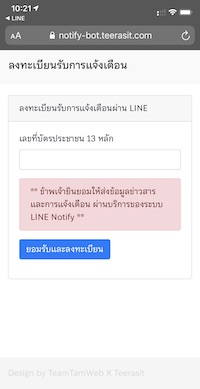

# LINE-Notify-1-1

##ตัวอย่างการสร้าง LINE NOTIFY 1-1 Chat 
### ลองเอาไปใช้งานปรับ Souce code ดู

##วีธีการเบื้องต้น
- สร้าง Service Provider ของ LINE ก่อนเพื่อให้ได้ค่า client id, secret มาใช้งานระบบ สร้างได้ที่ ttps://notify-bot.line.me/en/
- สร้าง table เพื่อเก็บข้อมูลตามตัวอย่าง table ที่ให้ไป
- แก้ไฟล์ config.php, public/js/service.js
- ลงทะเบียนใช้ register.php ส่วนตัวอยางการส่งแจ้งเตือนใช้ send-notify.php
- ตัวอย่าง code เป็น php และใช้ php pdo ในการ connect database

## Screenshot

